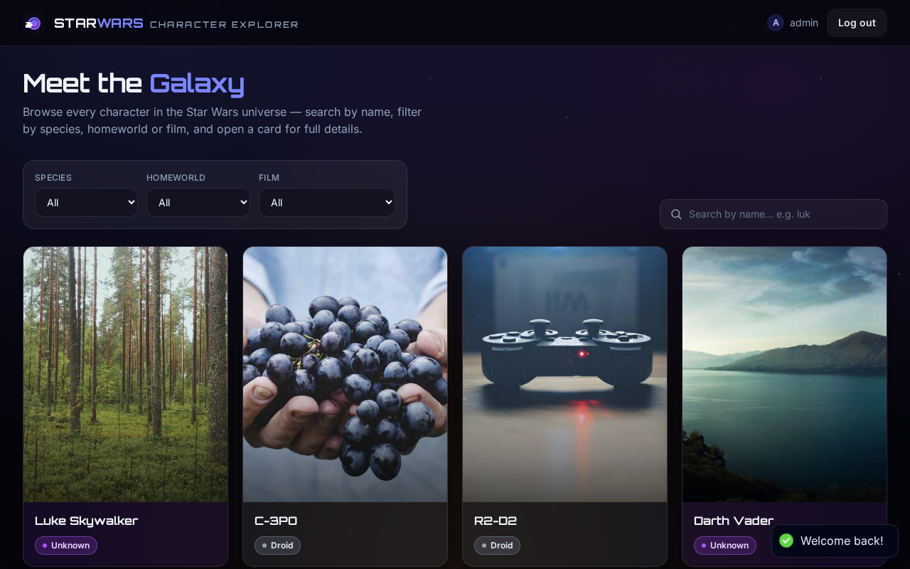
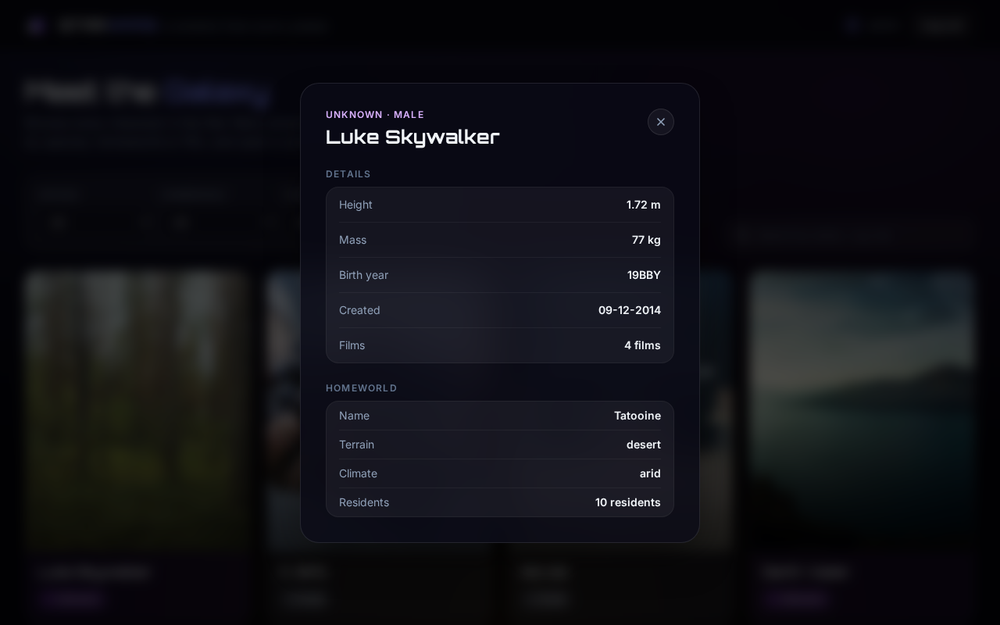
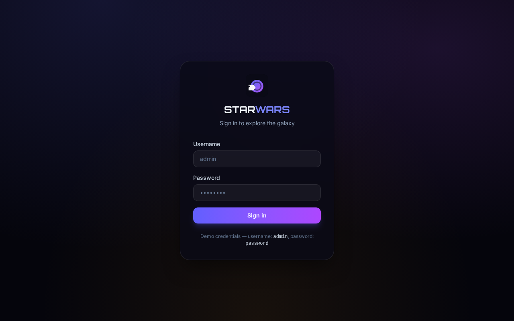
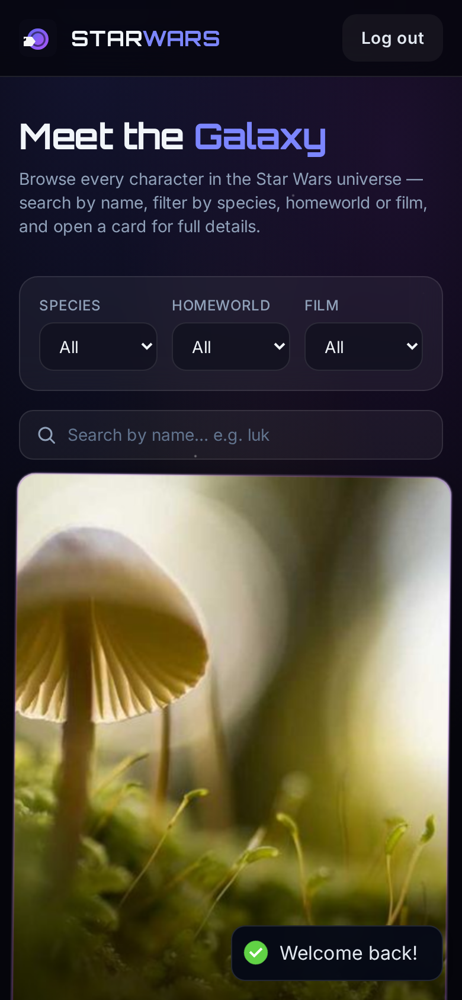
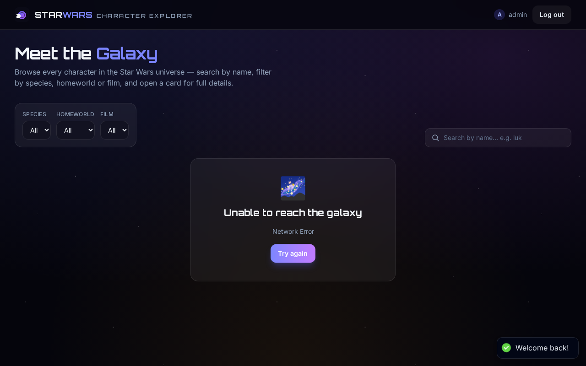

# Star Wars Character Explorer

A single-page application for browsing Star Wars characters from the [SWAPI mirror](https://swapi.info/api/people) REST API. Built with React 19, TypeScript, Vite, Tailwind CSS v4, TanStack Query, and Motion.

## Live demo

**Deployment link:** [tsx-mern-06-aug2026-pink.vercel.app](https://tsx-mern-06-aug2026-pink.vercel.app/)

**Source:** [github.com/amitesh-183/tsx-mern-06Aug2026](https://github.com/amitesh-183/tsx-mern-06Aug2026)

## Features

- **Authentication** — mock JWT login (`admin` / `password`) with short-lived access + long-lived refresh tokens persisted to `localStorage`, silent refresh when the access token expires, and protected routes that redirect to `/login`.
- **Character directory** — responsive grid with card images, species-colored theming, and pagination.
- **Search & filters** — debounced search and dropdown filters for species, homeworld, and film; filters are applied client-side over a cached full dataset, and the URL stays in sync (`?q=…&species=…`).
- **Character details modal** — accessible modal (focus trap, Escape/backdrop/close-button dismissal, focus restore) showing physical stats, films, and a live homeworld card (population, climate, terrain, resident count).
- **Data fetching** — TanStack Query with an Axios-backed service layer; requests are cached and shared across components.
- **Loading & error states** — skeleton cards, full-screen spinners, inline empty states, and a retry-capable global error boundary.
- **Polish** — Motion transitions, starfield background, custom glassmorphism and fonts, skeleton shimmer, `prefers-reduced-motion` support, and route-level code splitting.
- **Quality** — 30 unit/integration tests, strict TypeScript, ESLint + Prettier.

## Screenshots

**Character grid (desktop)** — paginated cards with species-colored themes and Picsum images:



**Character details modal** — height, mass, birth year, created date, film count, and live homeworld info:



**Login** and **mobile layout**:





**Error state** (simulated API outage with retry):



## Tech stack

| Layer         | Choice                                                           |
| ------------- | ---------------------------------------------------------------- |
| UI            | React 19, TypeScript, Vite                                       |
| Styling       | Tailwind CSS v4 (`@tailwindcss/vite`), custom theme              |
| State / data  | TanStack Query, Axios                                            |
| Routing       | React Router (data router via `createBrowserRouter`)            |
| Animation     | Motion (`motion/react`)                                         |
| Notifications | react-hot-toast                                                  |
| Dates         | date-fns v4 + `@date-fns/tz`                                     |
| Testing       | Vitest, React Testing Library, jsdom                             |
| Lint / format | ESLint (typescript-eslint, react-hooks, react-refresh), Prettier |

## Getting started

**Prerequisites:** Node.js 20.19+ (developed against Node 24).

```bash
# 1. Install dependencies
npm install

# 2. Start the dev server
npm run dev
```

Open the printed URL (default `http://localhost:5173`). Log in with:

- **Username:** `admin`
- **Password:** `password`

## Scripts

| Command                 | Description                                           |
| ----------------------- | ----------------------------------------------------- |
| `npm run dev`           | Start the Vite dev server                             |
| `npm run build`         | Type-check (`tsc -b`) then produce a production build |
| `npm run preview`       | Preview the production build locally                  |
| `npm run lint`          | ESLint over the whole project                         |
| `npm run format`        | Auto-format with Prettier                             |
| `npm run format:check`  | Verify formatting                                     |
| `npm run test`          | Run the test suite once                               |
| `npm run test:watch`    | Run tests in watch mode                               |
| `npm run test:coverage` | Run tests with coverage                               |
| `npm run typecheck`     | TypeScript project check (`tsc -b`)                   |

## Project structure

```
src/
  api/            Axios HTTP client (base URL)
  App.tsx         Root App (providers, routing)
  assets/         Static assets
  components/     UI components, grouped by domain
    auth/         AuthProvider (context), ProtectedRoute
    characters/   Cards, grid, modal, search, filters, homeworld info
    modal, ui/      Reusable primitives (Modal, Button, Skeleton, …)
  hooks/          Data hooks (React Query), URL-synced filters, debounce,
                  focus trap
  layouts/        AppLayout (starfield, navbar, page transition)
  pages/          Route-level lazy pages (Home, Login, NotFound)
  services/       SWAPI service layer, auth service, raw→domain mappers
  tests/          Vitest setup, fixtures, and test suites
  types/          Single `index.ts` — every type/interface in the app (domain,
                  raw API payloads, props, hook results)
  utils/          format, id/URL, species color, random image
```

## Architecture notes

- **Service layer owns HTTP.** Components never touch Axios. Each SWAPI resource has a service (`characterService`, `homeworldService`, `speciesService`, `filmService`) that returns domain objects; TanStack Query hooks in `src/hooks/useCharacters.ts` wrap these, so API shapes and caching are fully decoupled.
- **UI state is local + URL-based.** The URL query string is the single source of truth for the current page, search term and filters (`useCharacterFilters`), so views are shareable and survive refreshes. The selected character for the details modal is plain component state in `Home`.
- **Pagination strategy.** The API returns the complete collection as a single JSON array (it has no server-side pagination or `?search=` support). The app therefore fetches all 82 characters once — cached by TanStack Query — and applies search, filters, and pagination entirely client-side, so every feature works across the full dataset.

## Deployment

The app is fully static and deploys to Vercel as-is (SPA fallback included via `vercel.json` in the repo root).

**Vercel**

```bash
npm i -g vercel
vercel            # follow the prompts (framework preset: Vite)
vercel --prod
```

> Deployed via Vercel at [tsx-mern-06-aug2026-pink.vercel.app](https://tsx-mern-06-aug2026-pink.vercel.app/).

## Assumptions & notes

- **SWAPI returns `https://` resource URLs.** A `toHttps` helper in `src/utils/idFromUrl.ts` normalizes every resource URL from the API in the mapper layer, protecting against mixed content if the mirror ever returns `http://` links.
- **Mock authentication.** Per the assignment, there is no backend. Credentials are checked against constants in `src/services/authService.ts`, and JWTs are locally constructed, signed, and validated. Swap the service for real API calls to go to production.
- **Card images** use [Picsum Photos](https://picsum.photos) (SWAPI ships no images). Every page load assigns characters a fresh random picture; within a session each character's image stays stable so filtering, searching, and paging don't cause image churn.
- **Dates** are formatted UTC via `@date-fns/tz` because date-fns v4 dropped the `timeZone` option and timezone-aware formatting otherwise shifts e.g. "1977-05-25" a day in non-UTC environments.
- **Lint**: the template's default oxlint was replaced with ESLint (`lint` script); oxlint config/dependency removed.
